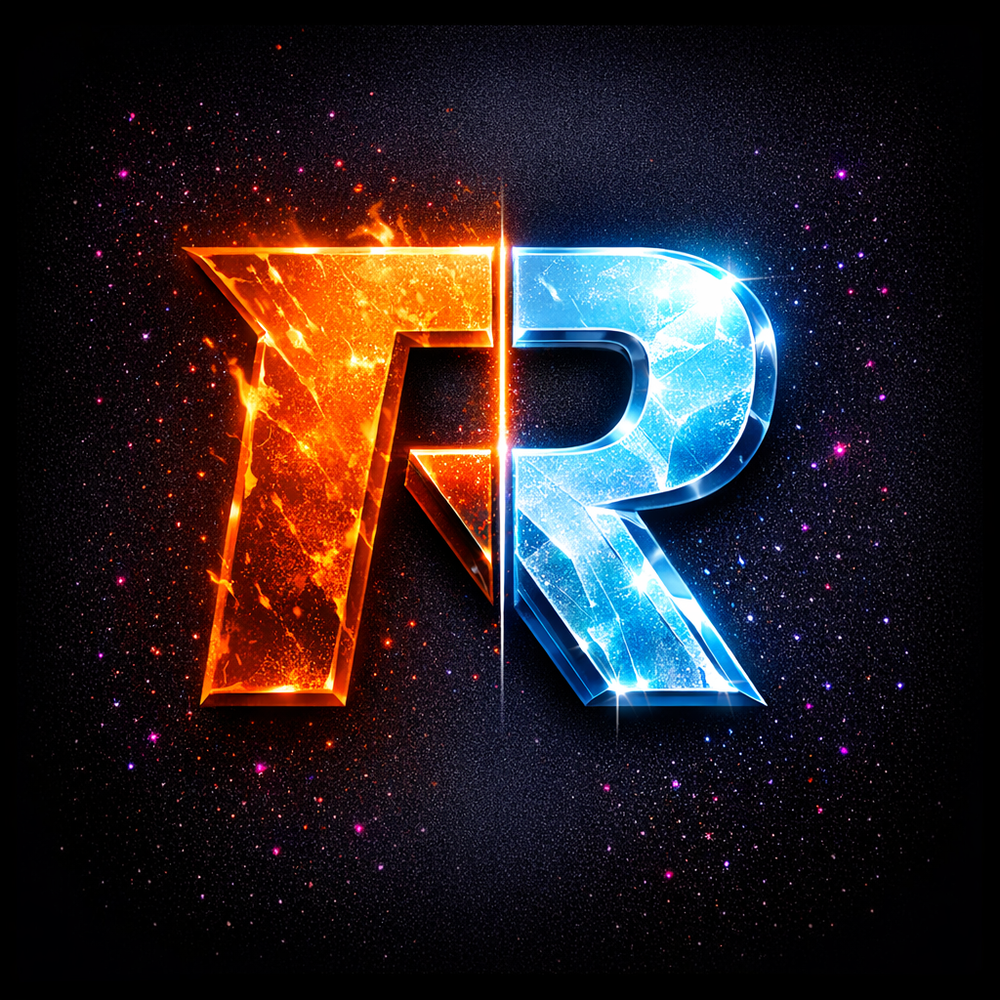
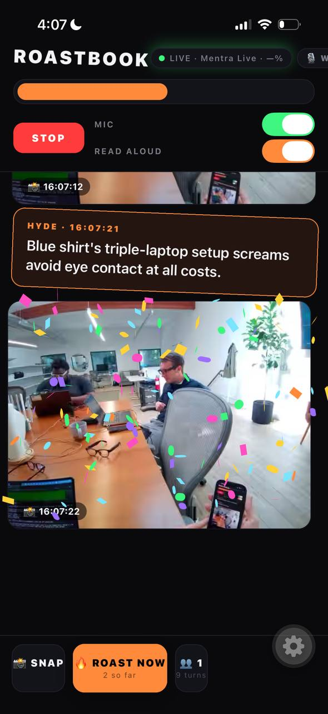

<p align="center">
  
</p>

<h1 align="center">Roastbook</h1>

<p align="center">
  <em>Real-time AI commentary on whoever you're looking at, streamed live through your smart glasses.</em>
</p>

<p align="center">
  
</p>

---

Smart-glasses companion app that watches your POV through a pair of
[Mentra Live](https://mentra.glass) glasses and provides real-time commentary on the
people you're looking at.

Two modes:

- **🔥 Hyde** — savage roasts of whoever's in frame, framed for the user's benefit.
- **✨ Jekyll** — warm, specific compliments about whoever's in frame.

The conceit: the glasses see your POV, the AI sees the person you're looking at, and
either trash-talks them (Hyde) or hypes them up (Jekyll). The system prompt frames the
targets as "NPCs in a hyper-realistic life-sim" — that's a guard-rail to keep the model
committed to actually mean output. The lines themselves read as real-world trash-talk;
gaming vocabulary is explicitly banned.

## Stack

| Capability                | Provider                          | Notes                                                              |
| ------------------------- | --------------------------------- | ------------------------------------------------------------------ |
| Glasses BLE / mic / camera | [`@mentra/bluetooth-sdk@0.1.2`](https://www.npmjs.com/package/@mentra/bluetooth-sdk) | Continuous 16 kHz PCM via `setMicState(..., bypassVad=true, ...)`. |
| Speech-to-text + speakers | ElevenLabs Scribe (`scribe_v1`)   | Diarized, per-word speaker labels.                                 |
| Vision + roast generation | xAI Grok (`grok-4.3`)             | Multi-modal, OpenAI-compatible chat endpoint.                      |
| TTS                       | ElevenLabs (`eleven_flash_v2_5`)  | Callum voice, low-latency model, `use_speaker_boost: true`.        |
| In-app photo receiver     | `mentra-direct-receiver`          | Native iOS module (HTTP listener via `Network.framework`).         |

## What's required

- A pair of **Mentra Live** glasses.
- A physical **iPhone** (BLE + camera don't work in the simulator).
- API keys for OpenAI (currently unused for transcription, only kept for ergonomics),
  ElevenLabs (STT + TTS), and xAI (roasts). All baked into `.env` as `EXPO_PUBLIC_*` vars.
- A Mac with Xcode 15+ and CocoaPods for the iOS build.

iOS background modes (`bluetooth-central`, `audio`) are configured in `app.json` so the
mic + glasses connection survive a screen lock. ElevenLabs audio plays through the phone
speaker via `expo-audio` with `interruptionMode: 'doNotMix'` so iOS routes it loud.

## .env setup

```bash
# .env (gitignored)
EXPO_PUBLIC_OPENAI_API_KEY=sk-...
EXPO_PUBLIC_ELEVENLABS_API_KEY=sk_...
EXPO_PUBLIC_ANTHROPIC_API_KEY=sk-ant-...
EXPO_PUBLIC_XAI_API_KEY=xai-...
```

Expo bakes `EXPO_PUBLIC_*` into the JS bundle at **build time**, not Metro reload time —
adding or rotating a key requires a fresh `npx expo run:ios`, not just `r`.

## Build

```bash
npm install
npx expo prebuild
npx expo run:ios --device "<your-iphone-name>"
```

## Using the app

1. **Auto-connect**: on launch the app calls `BluetoothSdk.connectDefault()` and tries
   to reconnect to your last-paired glasses. Status pill flips OFFLINE → CONNECTING →
   LIVE without you touching anything.
2. **Manual connect**: tap **CONNECT** if auto-connect didn't fire (or you've never
   paired). A scan sheet appears, lists nearby Mentra Live devices ranked by RSSI, tap
   one to connect.
3. **Mic** auto-enables on connect. The glasses stream continuous PCM over BLE.
4. **Photos** are auto-taken every 10s, plus once on each new speech turn. Tap **📸 SNAP**
   to take one on demand. Glasses button (short press) also takes a photo.
5. **Feed** shows transcript turns (color-coded by speaker), photos, and roasts/hype lines.
6. **🔥 HYDE / ✨ JEKYLL** toggle in the header flips persona. Colored highlight slides
   between halves.
7. **READ ALOUD** toggle has ElevenLabs speak each new line through the phone speaker.
8. **👥 N** opens the People sheet — rename Speaker 1/2/3, mark yourself with **I'M THIS**
   so the roasts don't target you.

Every new roast triggers a **confetti burst** in mode-appropriate colors. Buttons have
spring-squish + haptics on press. Status dot pulses while scanning/connecting. The logo
gives a small wiggle every 15 seconds. The CTA breathes gently. We get freaky.

## Glasses button shortcuts

- Short press → take a photo right now.
- Long press → toggle the glasses mic on/off.

## Echo gate (don't roast yourself)

When TTS is playing through the phone speaker, the glasses mic picks it up and would
otherwise transcribe the AI talking back to us, triggering another roast about the AI's
last roast (recursive doom loop). `src/ai/tts.ts` exposes an `isSpeaking()` flag and
`src/ai/sttPipeline.ts`'s `pushPcm()` drops frames while that's true plus a 600 ms tail.

## Project layout

```
src/
├── App.tsx                       # entry: gesture-handler root, auto-connect, confetti
├── store.ts                      # zustand store: turns, photos, roasts, people, settings
├── types.ts
├── sensors/
│   └── useGlassesSensors.ts      # BLE connect/scan, mic PCM ingest, photo capture, timers
├── ai/
│   ├── env.ts                    # EXPO_PUBLIC_* key access + assertion
│   ├── openai.ts                 # OpenAI transcribe + Responses API client (unused for now)
│   ├── anthropic.ts              # Anthropic Claude client (fallback for roast engine)
│   ├── xai.ts                    # xAI Grok client — current roast engine
│   ├── elevenlabsStt.ts          # ElevenLabs Scribe STT client
│   ├── sttPipeline.ts            # rolling PCM buffer → ElevenLabs → diarized turns → store
│   ├── roast.ts                  # Hyde / Jekyll persona, NPC-frame guard, vision input
│   ├── tts.ts                    # ElevenLabs synth + expo-audio playback + queue + echo gate
│   ├── index.ts                  # wireRoastTriggers, assertKeysOrThrow
│   └── wav.ts                    # PCM → WAV header, sample-rate constants
├── ui/
│   ├── TopBar.tsx                # logo wiggle, status pill (pulse + breathing glow), mode toggle
│   ├── Feed.tsx                  # SlideInCard-wrapped transcript turns, photos, roasts
│   ├── BottomBar.tsx             # SNAP / ROAST-NOW (breathing) / people. All PressyButtons.
│   ├── PeopleSheet.tsx           # rename Speaker N, mark "I'm this"
│   ├── ScanSheet.tsx             # device picker ranked by RSSI
│   ├── LogSheet.tsx              # in-app log tail (tap status pill to open)
│   ├── CaptureSheet.tsx          # mic-capture playback (debug, no UI entry-point currently)
│   ├── theme.ts                  # dark theme + Hyde orange / Jekyll cyan / speaker colors
│   └── anim/
│       ├── PressyButton.tsx      # squish-on-press + haptic
│       ├── PulseDot.tsx          # halo loop for status dot
│       └── SlideInCard.tsx       # slide+spring+wiggle on mount
└── ai/                           
```

## Tests

A Maestro UI smoke test lives at `maestro/smoke.yaml`. It launches the app, flips
Hyde↔Jekyll, toggles READ ALOUD, and opens the People sheet, asserting visibility at
each step. Screenshots land in `maestro/screenshots/`.

```bash
maestro --device <simulator-udid> test maestro/smoke.yaml
```

If you have multiple booted simulators or physical devices, pass `--device <udid>`
explicitly (`xcrun simctl list devices booted`) or Maestro will hang waiting for a
choice on stdin.

## Native modules

- **`modules/mentra-direct-receiver`** — vendored copy of the starter-kit's iOS native
  module, with GStreamer/WebRTC pieces stripped out. Only the photo HTTP receiver path
  remains. See `FEEDBACK2.md` issue #1 for why we had to do this.

## Patches against third-party packages

None at the moment. We previously carried a `patch-package` patch against
`@mentra/bluetooth-sdk@0.1.1` to fix a 3-line `GlassesStore` → `DeviceStore` rename that
prevented iOS from compiling. Fixed upstream in `0.1.2`.

## Feedback to the SDK author

Two markdown files in this repo capture issues we hit while building Roastbook against
the BT SDK:

- `FEEDBACK.md` — initial round (the `GlassesStore` blocker is now resolved).
- `FEEDBACK2.md` — current round (8 bugs + 4 polish nits + "what's working great").

## Privacy

Roastbook is a cloud-talking app: audio goes to ElevenLabs, photos go to xAI, TTS comes
from ElevenLabs. The keys live in `.env` (gitignored) and are baked into the JS bundle —
do **not** ship this binary anywhere public. If you record people without consent,
that's on you; the glasses, the app, and the cloud providers all assume you have it.
